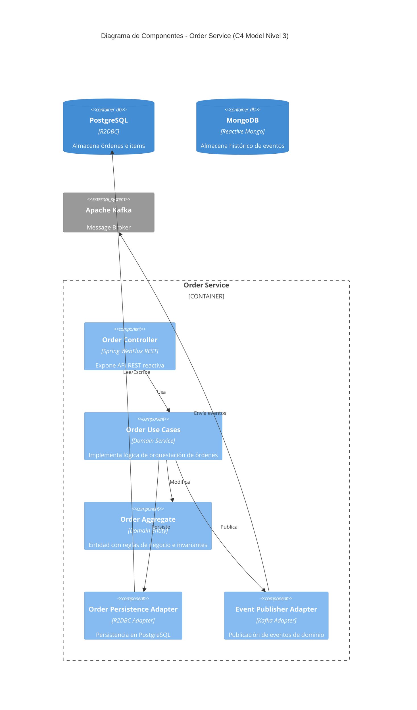

```mermaid
C4Component
    title Diagrama de Componentes - Order Service (C4 Model Nivel 3)

    Container_Boundary(order_service, "Order Service") {
        Component(controller, "Order Controller", "Spring WebFlux REST", "Expone API REST reactiva")
        Component(usecase, "Order Use Cases", "Domain Service", "Implementa lógica de orquestación de órdenes")
        Component(domain_model, "Order Aggregate", "Domain Entity", "Entidad con reglas de negocio e invariantes")
        Component(repo_adapter, "Order Persistence Adapter", "R2DBC Adapter", "Persistencia en PostgreSQL")
        Component(event_adapter, "Event Publisher Adapter", "Kafka Adapter", "Publicación de eventos de dominio")
        
        Rel(controller, usecase, "Usa")
        Rel(usecase, domain_model, "Modifica")
        Rel(usecase, repo_adapter, "Persiste")
        Rel(usecase, event_adapter, "Publica")
    }

    ContainerDb(postgres, "PostgreSQL", "R2DBC", "Almacena órdenes e items")
    ContainerDb(mongodb, "MongoDB", "Reactive Mongo", "Almacena histórico de eventos")
    System_Ext(kafka, "Apache Kafka", "Message Broker")

    Rel(repo_adapter, postgres, "Lee/Escribe")
    Rel(event_adapter, kafka, "Envía eventos")
```
