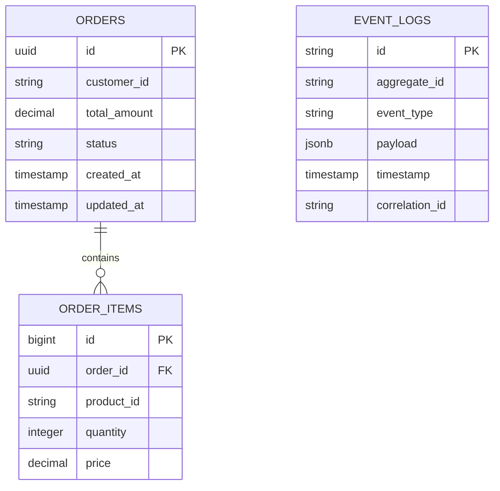

```mermaid
erDiagram
    ORDERS ||--o{ ORDER_ITEMS : contains
    ORDERS {
        uuid id PK
        string customer_id
        decimal total_amount
        string status
        timestamp created_at
        timestamp updated_at
    }
    ORDER_ITEMS {
        bigint id PK
        uuid order_id FK
        string product_id
        integer quantity
        decimal price
    }
    
    EVENT_LOGS {
        string id PK
        string aggregate_id
        string event_type
        jsonb payload
        timestamp timestamp
        string correlation_id
    }
```
