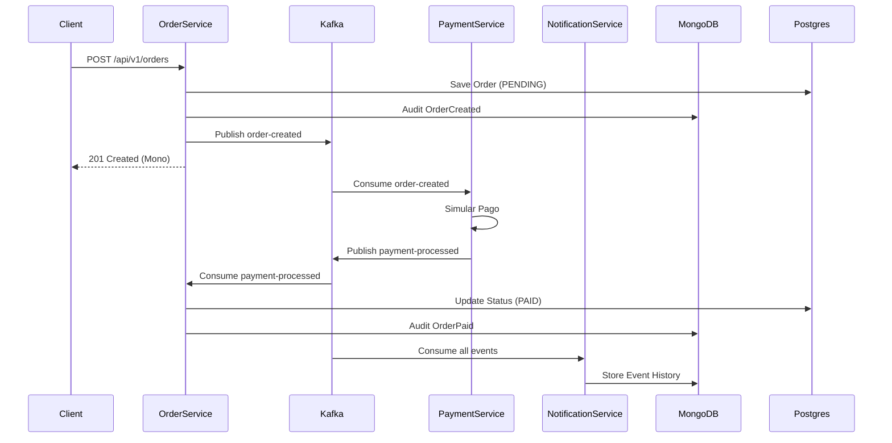
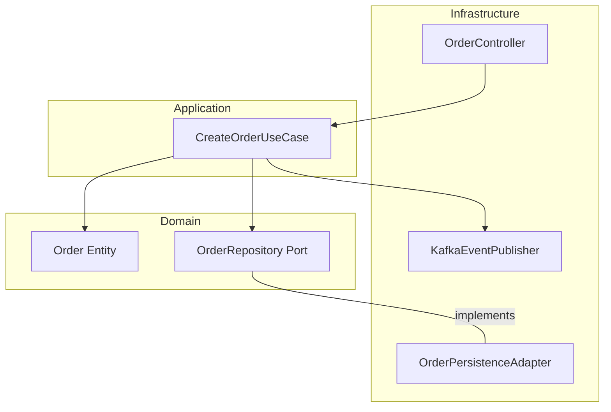

# Diagramas de Arquitectura

## Flujo de Eventos (Saga Choreography)

```mermaid
sequenceDiagram
    participant Client
    participant OrderService
    participant Kafka
    participant PaymentService
    participant NotificationService
    participant MongoDB
    participant Postgres

    Client->>OrderService: POST /api/v1/orders
    OrderService->>Postgres: Save Order (PENDING)
    OrderService->>MongoDB: Audit OrderCreated
    OrderService->>Kafka: Publish order-created
    OrderService-->>Client: 201 Created (Mono)
    
    Kafka->>PaymentService: Consume order-created
    PaymentService->>PaymentService: Simular Pago
    PaymentService->>Kafka: Publish payment-processed
    
    Kafka->>OrderService: Consume payment-processed
    OrderService->>Postgres: Update Status (PAID)
    OrderService->>MongoDB: Audit OrderPaid
    
    Kafka->>NotificationService: Consume all events
    NotificationService->>MongoDB: Store Event History
```

## Diagrama de Componentes (Hexagonal)

```mermaid
graph TD
    subgraph Infrastructure
        REST[OrderController]
        DB[OrderPersistenceAdapter]
        MSG[KafkaEventPublisher]
    end
    
    subgraph Application
        UC[CreateOrderUseCase]
    end
    
    subgraph Domain
        ENT[Order Entity]
        PRT[OrderRepository Port]
    end
    
    REST --> UC
    UC --> ENT
    UC --> PRT
    PRT -- implements --- DB
    UC --> MSG
```
