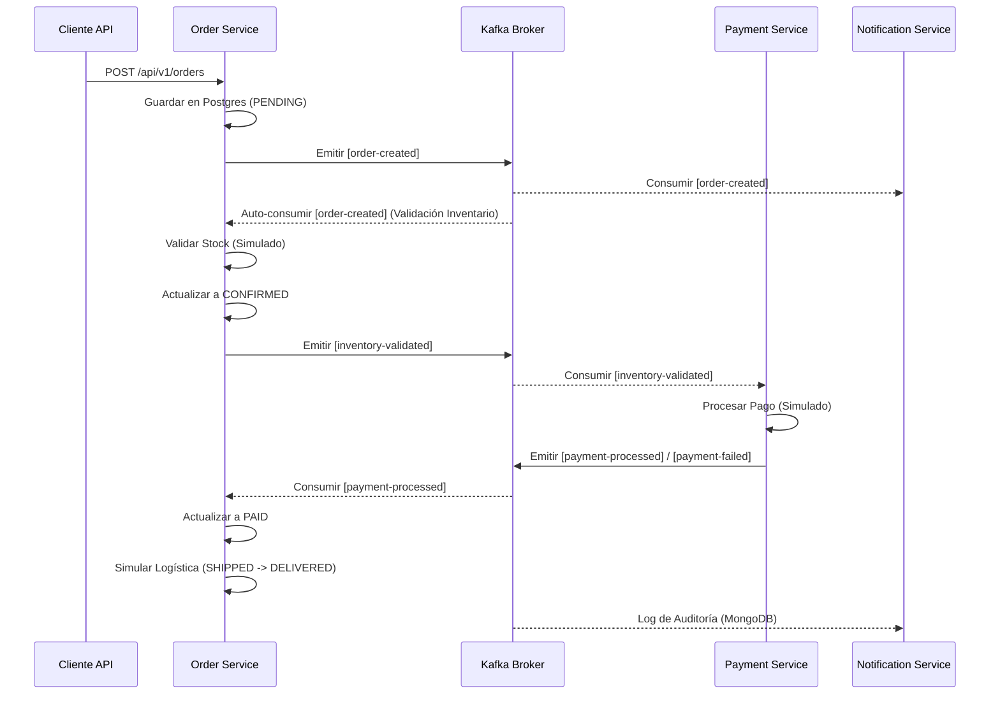

```mermaid
sequenceDiagram
    participant C as Cliente API
    participant O as Order Service
    participant K as Kafka Broker
    participant P as Payment Service
    participant N as Notification Service

    C->>O: POST /api/v1/orders
    O->>O: Guardar en Postgres (PENDING)
    O->>K: Emitir [order-created]
    K-->>N: Consumir [order-created]
    K-->>O: Auto-consumir [order-created] (Validación Inventario)
    
    O->>O: Validar Stock (Simulado)
    O->>O: Actualizar a CONFIRMED
    O->>K: Emitir [inventory-validated]
    
    K-->>P: Consumir [inventory-validated]
    P->>P: Procesar Pago (Simulado)
    P->>K: Emitir [payment-processed] / [payment-failed]
    
    K-->>O: Consumir [payment-processed]
    O->>O: Actualizar a PAID
    O->>O: Simular Logística (SHIPPED -> DELIVERED)
    
    K-->>N: Log de Auditoría (MongoDB)
```
